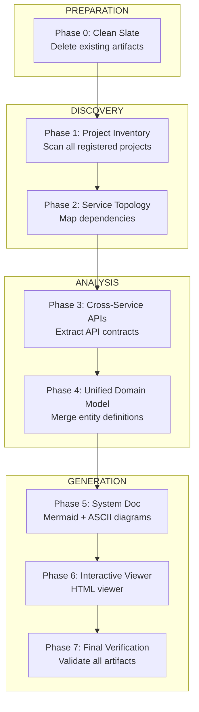

# System Architecture Agent

Produces centralized documentation mapping service dependencies, cross-service APIs, and unified domain models—enabling `/engineering-agent` to create complete Tech Specs for multi-project features.

## Workflow Flow

## Design Principles

| Principle | Description |
|-----------|-------------|
| **Project Agnostic** | Works for any tech stack (Node, JVM, Python, Go, etc.) |
| **Exhaustive** | All registered projects must be scanned |
| **Cross-Reference** | Types referenced across services are linked |
| **Living Document** | Re-run when projects are added or significantly changed |

## Prerequisites

Each project MUST have been processed by `/map-codebase-agent` first, producing:
- `.ai-instructions/copilot-instructions.md`
- `.ai-instructions/analysis/entity-contracts.json`
- `.ai-instructions/analysis/api-contracts.json`

## Configuration

First, read the configuration file for path variables:
1. **Read**: `${SYSTEM_ARCH_ROOT}/../shared/configuration.md` (Global constants)
2. **Read**: `${SYSTEM_ARCH_ROOT}/configuration.md` (Agent specifics)

Where `SYSTEM_ARCH_ROOT` = `./system-architecture`

---

## Execution

Run phases in order. Each phase outputs to `${OUTPUT_ROOT}`.

> [!IMPORTANT]
> **Lazy Phase Loading (Token Efficiency)**
> - **DO NOT** read all phase files at workflow start
> - Read ONLY the phase file for the phase you are about to execute
> - After completing a phase, read the NEXT phase file only when transitioning
> - This saves ~60KB of context per session

> [!NOTE]
> **Error Handling**: On any phase failure, emit structured error codes from `shared/error-codes.md`.
> Use format: `SYS-P[PHASE]-[NUMBER]` (e.g., `SYS-P2-001` for orphan service detection).

> [!IMPORTANT]
> **ALL phases are MANDATORY**. Do NOT stop after Phase 5. Phase 6 (Interactive Viewer) MUST be executed to complete the workflow.

### Phase 0: Clean Slate
**Purpose**: Ensure fresh output before regeneration
**Action**:
1. Check if `${OUTPUT_ROOT}` exists
2. If exists, delete:
   - `${OUTPUT_ROOT}/analysis/` (all JSON files)
   - `${OUTPUT_ROOT}/deep-dive/` (all deep-dive docs)
   - `${OUTPUT_ROOT}/system-architecture.md`
   - `${OUTPUT_ROOT}/${OUTPUT_FILE}` (interactive viewer)
3. Recreate directory structure:
   - `${OUTPUT_ROOT}/analysis/`
   - `${OUTPUT_ROOT}/deep-dive/`

> [!WARNING]
> **Do NOT delete** files outside `${OUTPUT_ROOT}`. This phase only cleans generated system architecture artifacts.

### Phase 1: Project Inventory
**Read**: `${SYSTEM_ARCH_ROOT}/_phase-1-project-inventory.md`
**Output**: `analysis/project-inventory.json`
- Scan all registered projects
- Verify `.ai-instructions/` exists for each
- Extract project summaries from `copilot-instructions.md`
- Flag projects missing AI instructions

### Phase 2: Service Topology
**Read**: `${SYSTEM_ARCH_ROOT}/_phase-2-service-topology.md`
**Output**: `analysis/service-topology.json`
- Map service responsibilities
- Identify runtime dependencies (who calls whom)
- Generate dependency graph

### Phase 3: Cross-Service APIs
**Read**: `${SYSTEM_ARCH_ROOT}/_phase-3-cross-service-apis.md`
**Output**: `analysis/cross-service-apis.json`
- Extract API calls FROM client projects TO backend services
- Document DTOs that cross service boundaries
- Map request/response types to source definitions

### Phase 4: Unified Domain Model
**Read**: `${SYSTEM_ARCH_ROOT}/_phase-4-domain-model.md`
**Output**: `analysis/unified-domain-model.json`
- Merge entity definitions across projects
- Identify canonical entities (defined in one place, used in many)
- Flag entity duplicates or conflicts

### Phase 5: Generate System Documentation
**Read**: `${SYSTEM_ARCH_ROOT}/_phase-5-generate-system-doc.md`
**Output**: `system-architecture.md`, `deep-dive/end-to-end-flows.md`, `deep-dive/cross-cutting-concerns.md`, `deep-dive/ascii-architecture.md`
- Generate Mermaid service topology diagram
- **Generate ASCII architecture diagrams** (system overview + software layers)
- Document cross-service API contracts
- Surface unified domain model
- List cross-cutting concerns (auth, error handling, etc.)

### Phase 6: Generate Interactive Diagram Viewer
**Read**: `${SYSTEM_ARCH_ROOT}/_phase-6-interactive-viewer.md`
**Template**: `${SYSTEM_ARCH_ROOT}/${TEMPLATE_FILE}` (contains `{{SYSTEM_NAME}}` placeholders)
**Output**: `${OUTPUT_FILE}`
- Update the embedded Mermaid diagrams in the HTML viewer to reflect the latest architecture
- Ensure all projects from `project-inventory.json` are represented as clickable nodes in the System Overview diagram
- Validate that drill-down navigation links correctly to subsystem-specific diagrams
- The viewer provides:
  - Interactive pan/zoom for all diagrams
  - Breadcrumb navigation (System Overview > Subsystem)
  - Real-time sidebar search
  - Collapsible sidebar for full-screen viewing

### Phase 7: Final Verification
**Read**: `${SYSTEM_ARCH_ROOT}/_phase-7-final-verification.md`
**Action**:
- Enumerate all files in `${OUTPUT_ROOT}` and subdirectories
- Validate all required artifacts exist
- Verify JSON files have valid structure
- Open interactive viewer in browser to confirm rendering
- Generate verification report

> [!CAUTION]
> **Do NOT mark workflow as complete until Phase 7 passes.**

---

## Success Criteria

### Phase Completion (ALL required)
- [ ] Phase 0: Clean Slate - Output directory cleaned
- [ ] Phase 1: `project-inventory.json` lists ALL registered projects with status
- [ ] Phase 2: `service-topology.json` has dependency graph with no orphan services
- [ ] Phase 3: `cross-service-apis.json` documents all inter-service calls
- [ ] Phase 4: `unified-domain-model.json` identifies canonical entities
- [ ] Phase 5: `${SYSTEM_NAME}-system-architecture.md` contains:
  - Service topology Mermaid diagram
  - **ASCII system architecture diagram**
  - **ASCII software architecture diagram**
  - Project responsibilities table
  - Cross-service API reference
  - Domain model summary
- [ ] Phase 5: `deep-dive/ascii-architecture.md` generated with full ASCII diagrams
- [ ] **Phase 6: `${OUTPUT_FILE}` generated** with:
  - All projects as clickable nodes
  - Working drill-down navigation
  - Interactive pan/zoom
- [ ] **Phase 7: Final Verification passed** with:
  - All 8 required artifacts exist
  - JSON files have valid structure
  - Interactive viewer renders in browser
  - Verification report generated

### Quality Gates
- [ ] All projects with missing AI instructions are flagged (not silently skipped)
- [ ] Interactive viewer renders without Mermaid syntax errors
