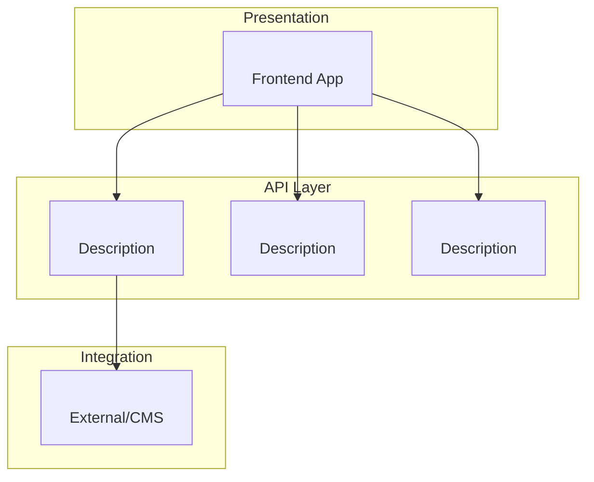
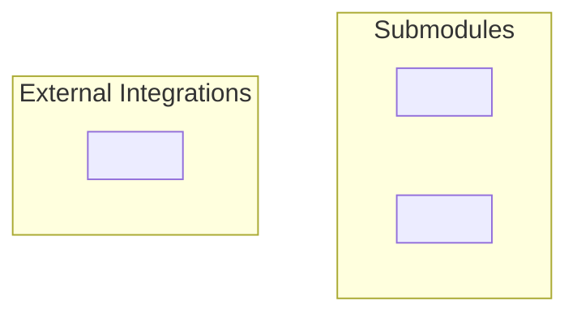

# Phase 5: Generate System Documentation

> **Goal**: Generate the final `system-architecture.md` and deep-dive documents.

---

## Input

- `${ANALYSIS_DIR}/project-inventory.json` (Phase 1)
- `${ANALYSIS_DIR}/service-topology.json` (Phase 2)
- `${ANALYSIS_DIR}/cross-service-apis.json` (Phase 3)
- `${ANALYSIS_DIR}/unified-domain-model.json` (Phase 4)

## Output

- `${OUTPUT_ROOT}/system-architecture.md`
- `${DEEP_DIVE_DIR}/end-to-end-flows.md`
- `${DEEP_DIVE_DIR}/cross-cutting-concerns.md`

---

## Instructions

### Step 1: Generate Service Topology Diagram

Create a Mermaid diagram showing all services and dependencies:



> [!CAUTION]
> **Diagram Edges MUST Match service-topology.json**
> - **ONLY** draw edges that exist in the `dependencies[]` array from Phase 2
> - Do **NOT** infer additional connections based on assumptions or documentation
> - Each edge in the diagram **MUST** have a corresponding entry in `dependencies[]`
> - If a connection is missing from `dependencies[]`, it means it was NOT verified against code and should NOT appear in the diagram

### Step 1.5: Validate Mermaid Diagram Against Source Data

Before finalizing the diagram, perform these checks:

| Check | Source | Diagram Requirement |
|-------|--------|---------------------|
| **Node Count** | `services.length` from `service-topology.json` | Must match node count (excluding subgraph labels) |
| **Edge Count** | `dependencies.length` from `service-topology.json` | Must match edge count exactly |
| **All Projects** | `project-inventory.json` (status=ready) | Every ready project must appear as a node |
| **No Phantom Edges** | `dependencies[]` array | Every `A --> B` must have `{from: A, to: B}` entry |

**Validation Procedure:**
1. For each edge `A --> B` you plan to draw:
   - Search `dependencies[]` for `{from: "A", to: "B"}`
   - If NOT found → **DO NOT draw this edge**
2. For each entry in `dependencies[]`:
   - Verify it appears as an edge in your diagram
   - If missing → **Add the edge**
3. Count nodes vs `services.length` - must match
4. Count edges vs `dependencies.length` - must match

**If validation fails**: Do NOT generate the diagram. Report the discrepancy.

### Step 1.6: Generate Per-Project Submodule Diagrams (MANDATORY for Libraries)

> [!IMPORTANT]
> **For projects with `internalModules[]` in `service-topology.json`, you MUST generate a detailed submodule diagram.**

For each project where `internalModules.length > 0`:

1. **Read `internalModules[]` from `service-topology.json`**
2. **Group modules by type** (Core, Client, Integration, etc.)
3. **Generate Mermaid subgraph**:



**Validation**: 
- Count nodes in diagram MUST equal `internalModules.length`
- If count doesn't match → diagram is INCOMPLETE

### Step 2: Generate Project Responsibilities Table

| Project | Type | Role | Endpoints | Key Entities |
|---------|------|------|-----------|--------------|
| <project-name> | <Frontend/Backend> | <role from inventory> | <count> | <key entities> |
| ... | ... | ... | ... | ... |

### Step 3: Generate Cross-Service API Reference

For each service pair:

#### <caller-service> → <callee-service>

| Endpoint | Method | Request | Response | Used By |
|----------|--------|---------|----------|---------|
| `<path>` | <METHOD> | <RequestDTO> | <ResponseDTO> | <components> |
| ... | ... | ... | ... | ... |

### Step 4: Generate Domain Model Summary

#### Domain Areas

| Area | Owner | Key Entities |
|------|-------|--------------|
| <DomainArea> | <owning-project> | <EntityA>, <EntityB> |
| ... | ... | ... |

#### Canonical Entities

List entities that are defined once but used across services.

### Step 5: Document Cross-Cutting Concerns

Analyze projects for:

| Concern | Pattern | Projects |
|---------|---------|----------|
| Authentication | <pattern> | <projects> |
| Error Handling | <pattern> | <projects> |
| Logging | <pattern> | <projects> |
| Caching | <pattern> | <projects> |

---

## system-architecture.md Template

```markdown
# System Architecture

> Generated: {timestamp}
> Projects: {count}

## Service Topology

{Mermaid diagram}

## Project Responsibilities

{Table from Step 2}

## Cross-Service API Reference

{Sections from Step 3}

## Domain Model

### Domain Areas
{Table from Step 4}

### Canonical Entities
{List from Step 4}

### Entity Conflicts
{Warnings from unified-domain-model.json}

## Cross-Cutting Concerns

{Table from Step 5}

## How to Use This Document

### Integration with /engineering-agent

| Engineering Mode | System Architecture File | When to Read | Purpose |
|-----------------|-------------------------|--------------|---------|
| **TechSpec Step 2** | `service-topology.json` | BEFORE identifying projects | Discover all upstream/downstream dependencies |
| **TechSpec Step 2** | `service-topology.json` → `calledBy` | After identifying scope | Find consumers affected by changes |
| **TechSpec § 5.2** | `unified-domain-model.json` | When defining entities | Use canonical entity definitions |
| **TechSpec § 5.3** | `cross-service-apis.json` | When defining API contracts | Get existing cross-service signatures |
| **TaskPlanning** | `cross-service-apis.json` | Context injection step | Inject cross-service API context into tasks |
| **BugReport Step 6** | `service-topology.json` | Cross-repo analysis | Trace service chain for bug isolation |
| **BugFix Step 2** | `cross-service-apis.json` | Impact assessment | Verify fix doesn't break callers |

### Quick Reference for Multi-Project Features

1. **Before TechSpec**: Read `service-topology.json`
   - Check both `callsServices` AND `calledBy` for each service in scope
   - Add transitively affected services to Epic scope
2. **During TechSpec**: Read `unified-domain-model.json`
   - Use `canonicalSource` for entity definitions
   - Flag any `conflicting` fields
3. **During TaskPlanning**: Read `cross-service-apis.json`
   - Copy endpoint contracts into cross-service tasks

### Prerequisites (Data Source)
This document aggregates data from projects processed by `/map-codebase-agent`.

If project AI instructions are stale, re-run:
1. `/map-codebase-agent` on affected project(s)
2. `/system-architecture-agent` to refresh this document

### Updating This Document
Run `/system-architecture-agent` after:
- Adding a new project
- Significant API changes
- New cross-service integrations
```

---

## Deep-Dive: End-to-End Flows

Generate `end-to-end-flows.md` with:

### Flow Template

```markdown
## Flow: <Flow Name>

### Overview
<Brief description of what this flow accomplishes>

### Service Chain
<service-a> → <service-b> → <service-c> → <service-d>

### Sequence
1. **<service-a>**: <user action or trigger>
2. **<service-b>**: `<METHOD> <endpoint>` <what it does>
3. **<service-c>**: `<METHOD> <endpoint>` <what it does>
4. **<service-d>**: `<METHOD> <endpoint>` <what it does>

### Data Flow
{Mermaid sequence diagram}
```

---

## Deep-Dive: Cross-Cutting Concerns

Generate `cross-cutting-concerns.md` documenting shared patterns.

## Step 6: Update ALL Existing Output Files (MANDATORY)

> [!IMPORTANT]
> **Before completing Phase 5, you MUST enumerate and update ALL existing files in `${OUTPUT_ROOT}`.**
> This includes the root directory AND all subdirectories (analysis/, deep-dive/, etc.).
> Do NOT assume you know what files exist - always enumerate dynamically.

### 6.1 Enumerate Entire Output Directory Tree

```
list_dir("${OUTPUT_ROOT}")
```

For each subdirectory found (e.g., `analysis/`, `deep-dive/`):
```
list_dir("${OUTPUT_ROOT}/<subdirectory>")
```

### 6.2 Process Each File Found

**For EVERY `.md`, `.json`, and `.html` file found:**

1. **Read the file** to understand its structure
2. **Identify project-related content**:
   - Project lists or counts
   - Service names in diagrams, tables, or code
   - Dependency lists
   - Coverage statistics
3. **Update with new project information** where applicable
4. **Update timestamps** if the file has a `generatedAt` field

### 6.3 Common Patterns to Check

| File Type | What to Update |
|-----------|----------------|
| `*.json` (analysis/) | Project counts, service arrays, coverage stats |
| `*.md` (root, deep-dive/) | Mermaid diagrams, project tables, service lists |
| `*.html` (viewers) | Embedded diagrams, navigation items |

### 6.4 Validation Checklist

Before marking Phase 5 complete:

- [ ] `list_dir("${OUTPUT_ROOT}")` executed
- [ ] `list_dir()` executed on EACH subdirectory
- [ ] **Every file** in the directory tree was read
- [ ] New project added to all relevant sections
- [ ] No file or directory was skipped

---

## Validation

| Check | Requirement |
|-------|-------------|
| Mermaid valid | Diagram renders without errors |
| All services included | Count matches project inventory |
| Links valid | All entity/API references resolvable |
| Sections complete | No empty tables or placeholders |
| **Full tree enumerated** | `list_dir()` on root AND all subdirectories |
| **All files processed** | Every file in tree was read and updated if needed |
| **Counts consistent** | Project counts match across all JSON/MD files |
