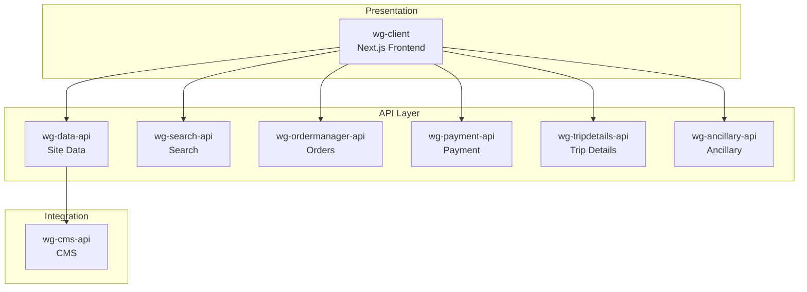

# Phase 5: Generate System Documentation

> **Goal**: Generate the final `system-architecture.md` and deep-dive documents.

---

## Input

- `${ANALYSIS_DIR}/project-inventory.json` (Phase 1)
- `${ANALYSIS_DIR}/service-topology.json` (Phase 2)
- `${ANALYSIS_DIR}/cross-service-apis.json` (Phase 3)
- `${ANALYSIS_DIR}/unified-domain-model.json` (Phase 4)

## Output

- `${OUTPUT_ROOT}/system-architecture.md`
- `${DEEP_DIVE_DIR}/end-to-end-flows.md`
- `${DEEP_DIVE_DIR}/cross-cutting-concerns.md`

---

## Instructions

### Step 1: Generate Service Topology Diagram

Create a Mermaid diagram showing all services and dependencies:



### Step 2: Generate Project Responsibilities Table

| Project | Type | Role | Endpoints | Key Entities |
|---------|------|------|-----------|--------------|
| wg-client | Frontend | Web application | N/A | Views all entities |
| wg-data-api | Backend | Site configuration | 48 | SiteConfig, EngineData |
| ... | ... | ... | ... | ... |

### Step 3: Generate Cross-Service API Reference

For each service pair:

#### wg-client → wg-data-api

| Endpoint | Method | Request | Response | Used By |
|----------|--------|---------|----------|---------|
| `/site/getEngineData` | POST | EngineDataRequest | EngineDataResponse | SearchWidget |
| ... | ... | ... | ... | ... |

### Step 4: Generate Domain Model Summary

#### Domain Areas

| Area | Owner | Key Entities |
|------|-------|--------------|
| Booking | wg-ordermanager-api | BookingData, BookingRequest |
| Payment | wg-payment-api | PaymentData, PaymentRequest |
| Search | wg-search-api | SearchRequest, PackageData |

#### Canonical Entities

List entities that are defined once but used across services.

### Step 5: Document Cross-Cutting Concerns

Analyze projects for:

| Concern | Pattern | Projects |
|---------|---------|----------|
| Authentication | JWT Bearer | All |
| Error Handling | ErrorResponse DTO | All backends |
| Logging | Structured JSON | All backends |
| Caching | Redis | wg-data-api, wg-search-api |

---

## system-architecture.md Template

```markdown
# WG3 System Architecture

> Generated: {timestamp}
> Projects: {count}

## Service Topology

{Mermaid diagram}

## Project Responsibilities

{Table from Step 2}

## Cross-Service API Reference

{Sections from Step 3}

## Domain Model

### Domain Areas
{Table from Step 4}

### Canonical Entities
{List from Step 4}

### Entity Conflicts
{Warnings from unified-domain-model.json}

## Cross-Cutting Concerns

{Table from Step 5}

## How to Use This Document

### For /engineering-agent
When planning multi-project features:
1. Check Service Topology for impacted services
2. Review Cross-Service APIs for integration points
3. Consult Domain Model for entity definitions
4. Verify Cross-Cutting Concerns for consistency

### Updating This Document
Run `/system-architecture-agent` after:
- Adding a new project
- Significant API changes
- New cross-service integrations
```

---

## Deep-Dive: End-to-End Flows

Generate `end-to-end-flows.md` with:

### Flow Template

```markdown
## Flow: Search to Booking

### Overview
User searches for packages and completes a booking.

### Service Chain
wg-client → wg-search-api → wg-ordermanager-api → wg-payment-api

### Sequence
1. **wg-client**: User enters search criteria
2. **wg-search-api**: `POST /search/packages` returns available packages
3. **wg-client**: User selects package
4. **wg-ordermanager-api**: `POST /order/create` creates booking
5. **wg-payment-api**: `POST /payment/process` handles payment

### Data Flow
{Mermaid sequence diagram}
```

---

## Deep-Dive: Cross-Cutting Concerns

Generate `cross-cutting-concerns.md` documenting shared patterns.

---

## Validation

| Check | Requirement |
|-------|-------------|
| Mermaid valid | Diagram renders without errors |
| All services included | Count matches project inventory |
| Links valid | All entity/API references resolvable |
| Sections complete | No empty tables or placeholders |
