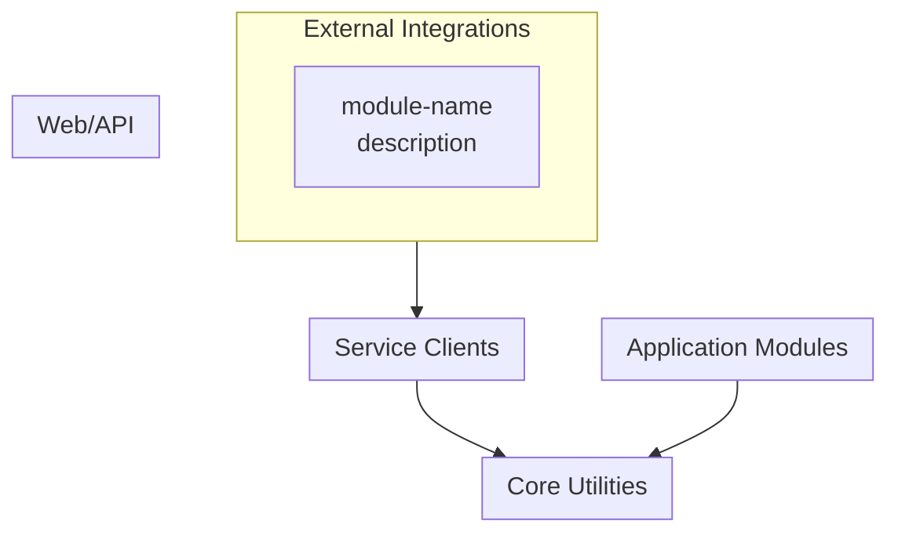
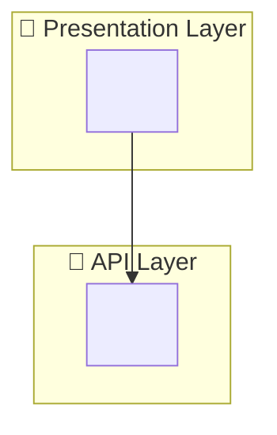

# Phase 6: Interactive Diagram Viewer

> **Goal**: Generate an interactive HTML viewer with Mermaid diagrams for all projects, derived from the analysis JSON files.

---

## Input

- `${ANALYSIS_DIR}/project-inventory.json` (from Phase 1)
- `${ANALYSIS_DIR}/service-topology.json` (from Phase 2)
- Each project's `copilot-instructions.md` (for architecture diagrams)

## Template

- `${SYSTEM_ARCH_ROOT}/${TEMPLATE_FILE}`

## Output

- `${OUTPUT_ROOT}/${OUTPUT_FILE}`

---

## Instructions

### Step 1: Read Service Topology

Load `service-topology.json` to get:
- List of all services with their `type`, `role`, and `callsServices`
- `dependencies` array for edges
- `layers` object for grouping

### Step 2: Generate System Overview Diagram

Create the main Mermaid diagram from topology data:

```mermaid
graph TB
    subgraph Presentation["📱 Presentation Layer"]
        %% For each service in layers.presentation
        <SERVICE_ID>["<service-name><br/><role>"]
    end
    
    subgraph Orchestration["🎯 Orchestration Layer"]
        %% For each service in layers.orchestration (if exists)
    end
    
    subgraph API["🔌 API Layer"]
        %% For each service in layers.api
    end
    
    subgraph Data["💾 Data Layer"]
        %% For each service in layers.data
    end
    
    subgraph Shared["🔧 Shared Library"]
        %% For each service in layers.shared
    end
    
    %% For each dependency edge, add:
    %% <from-id> --> <to-id>  (for http dependencies)
    %% <from-id> -.-> <to-id> (for library dependencies)
    
    %% Add click callbacks for drill-down:
    %% click <SERVICE_ID> call navigateTo("<service-id>")
```

**Diagram Generation Rules**:

| Field | Mermaid Mapping |
|-------|-----------------|
| `service.name` | Node ID (lowercase, no dashes) |
| `service.name + role` | Node label |
| `dependency.from → to` | Edge (solid for http, dashed for library) |
| Layer from `layers` object | Subgraph assignment |

### Step 3: Generate Per-Project Diagrams

> ⚠️ **CRITICAL**: Every per-project diagram MUST include ALL modules from `service-topology.json → services[name].internalModules`. No module may be omitted.

For each project in `project-inventory.json`:

#### 3.1 Extract ALL Internal Modules

```
For service in service-topology.json.services:
    modules = service.internalModules
    
    # Group by type
    groups = {
        "External Integration": [],
        "Service Client": [],
        "Core/Utility": [],
        "Application Module": [],
        "Web/API Module": []
    }
    
    For module in modules:
        groups[module.type].append(module.name)
    
    # VALIDATION: Count must match
    total_extracted = sum(len(g) for g in groups.values())
    assert total_extracted == len(modules), "Missing modules!"
```

#### 3.2 Generate Mermaid Code

For each non-empty group, create a subgraph containing ALL modules in that group:



### UI/UX Requirements

The generated HTML MUST use:
1. **Premium Palette**: Indigo primary (`#4f46e5`), Slate background (`#f8fafc`).
2. **Glassmorphism**: Backdrop blur on sidebar and tooltips.
3. **Vertical Layout**: All diagrams must use `graph TB`.
4. **Enhanced Highlighting**:
   - Hovered node: 100% opacity, glow, larger scale.
   - Connected lines: Highlighted with `stroke-width: 4px` and primary color.
   - Non-connected elements: Dimmed to 10% opacity.

#### 3.3 Example: Shared Library (Generic)

Given `service-topology.json`:
```json
{
    "name": "example-shared-lib",
    "internalModules": [
        {"name": "lib-external-api", "type": "External Integration"},
        {"name": "lib-soap-client", "type": "Service Client"},
        {"name": "lib-utils", "type": "Core/Utility"},
        {"name": "lib-business-logic", "type": "Application Module"}
    ]
}
```

**Expected diagram MUST have 4 nodes**:
- 1 in External Integrations
- 1 in Service Clients  
- 1 in Core Utilities
- 1 in Application Modules

**If any module is missing, the generation FAILS validation.**

### Step 4: Build Diagrams Array

Construct the JavaScript `diagrams` array for the HTML:

```javascript
const diagrams = [
    {
        id: 'system-overview',
        title: 'System Overview',
        code: `<generated-mermaid-from-step-2>`
    },
    // For each project:
    {
        id: '<project-name>',
        title: '<N>. <project-name> (<type>)',
        code: `<generated-mermaid-from-step-3>`
    }
    // ... one entry per project
];
```

### Step 5: Generate HTML Output

1. **Copy** `${TEMPLATE_FILE}` to output location
2. **Replace** the placeholder `const diagrams = [...]` section with the generated diagrams array
3. **Update** the page title to match the system name

---

## Enhanced UX Features

### Path Highlighting on Hover

When user hovers over a node:
1. **Dim non-connected nodes** - Set opacity to 0.2 for nodes not in the path
2. **Highlight connected edges** - Increase stroke-width and change color to primary
3. **Highlight connected nodes** - Keep full opacity and add glow effect
4. **Show tooltip** - Display node name and role

**Implementation**:
- Add `mouseenter`/`mouseleave` listeners to all `.node` elements
- Build adjacency map from `dependencies` array
- On hover: add `.dimmed` class to non-connected, `.active` to connected
- On leave: remove all highlight classes **after a 150-200ms delay** (Debounce)
  - This prevents flickering when moving between nodes
  - If a new `mouseenter` occurs during the delay, cancel the clear timer

**CSS Classes**:
```css
.diagram-container.interacting .node { opacity: 0.2; transition: opacity 0.3s; }
.diagram-container.interacting .edgePath .path { opacity: 0.2; }
.diagram-container.interacting .node.active { opacity: 1; }
.diagram-container.interacting .node.active rect { 
    stroke: var(--primary) !important; 
    filter: drop-shadow(0 0 8px rgba(99, 102, 241, 0.4)); 
}
.diagram-container.interacting .edgePath .path.active { 
    stroke: var(--primary) !important; 
    stroke-width: 3px !important; 
    opacity: 1; 
}
```

### Click Navigation

When user clicks a node:
1. **System Overview nodes** → Navigate to per-project drill-down diagram
2. **Per-project nodes** → Navigate to external project path if available

**Click Handler**:
```javascript
function handleNodeClick(nodeId) {
    // Check if drill-down diagram exists
    const targetDiagram = diagrams.find(d => d.id === nodeId);
    if (targetDiagram) {
        navigateTo(nodeId);
        return;
    }
    
    // Fall back to project path navigation (VS Code compatible)
    const project = projectPaths[nodeId];
    if (project) {
        window.location.href = `vscode://file/${project.path}`;
    }
}
```

**Project Path Mapping** (generated from `project-inventory.json`):
```javascript
// Auto-generated from project-inventory.json
const projectPaths = {
    // For each project in project-inventory.json:
    // '<project-name>': { path: project.path, type: project.type }
};
```

---

## Output Validation

| Check | Requirement |
|-------|-------------|
| All projects included | Count of per-project diagrams matches project-inventory ready count |
| System overview complete | All services from topology appear in overview diagram |
| **Module completeness** | Each per-project diagram includes ALL `internalModules` from `service-topology.json` |
| Click navigation works | Every node has a `click ... call navigateTo()` callback |
| Drill-down exists | Each click target has a matching diagram id |
| HTML renders | File opens in browser without Mermaid syntax errors |
| **Initial zoom fits all** | Default zoom level shows entire diagram without clipping |

### Module Completeness Validation

For each project diagram, verify:

```
Expected modules = service-topology.json → services[name].internalModules.length
Actual nodes in diagram = count of nodes in Mermaid code

If Expected != Actual:
    ❌ FAIL - Missing modules from diagram
    → Re-generate diagram including ALL internalModules
```

**Common Causes of Missing Modules**:
1. **Grouping by type** - Ensure all module types are represented (External Integration, Service Client, Core/Utility, Application Module, Web/API Module)
2. **Subgraph limits** - Mermaid has no subgraph limit, but complex diagrams may need layout adjustments
3. **Copy-paste errors** - Verify module list matches source JSON exactly

### Zoom Configuration

The HTML template MUST configure initial zoom to fit entire diagram:

```javascript
// In svgPanZoom initialization:
panZoomInstances[id] = svgPanZoom(svgElement, {
    zoomEnabled: true,
    fit: true,        // ← Essential: fit diagram to container
    center: true,     // ← Essential: center after fit
    minZoom: 0.1,     // ← Allow zooming out to see large diagrams
    maxZoom: 5
});

// Do NOT apply fixed zoom after fit for complex diagrams:
// WRONG: panZoomInstances[id].zoom(0.85);
// RIGHT: Let fit: true determine initial zoom, OR use adaptive zoom:
const nodeCount = container.querySelectorAll('.node').length;
const adaptiveZoom = nodeCount > 10 ? 0.7 : 0.85;
panZoomInstances[id].zoom(adaptiveZoom);
```

---

## Diagram Style Guide

### Node Naming Convention

| Service Type | ID Pattern | Label Format |
|--------------|------------|--------------|
| Frontend | `CLIENT` | `<name><br/><framework> Frontend` |
| Backend | `<SERVICE_CAPS>` | `<name><br/><short-role>` |
| Shared Library | `LTS` or `CORE` | `<name><br/>Core Integrations` |

### Edge Types

| Dependency Type | Mermaid Syntax | Visual |
|-----------------|----------------|--------|
| HTTP runtime | `A --> B` | Solid line |
| Library/compile-time | `A -.-> B` | Dashed line |
| Message queue | `A -->>` B | Arrow with double head |

### Layer Colors (CSS in template)

| Layer | Subgraph Emoji | Purpose |
|-------|----------------|---------|
| Presentation | 📱 | User-facing apps |
| Orchestration | 🎯 | Workflow coordinators |
| API | 🔌 | Business logic services |
| Data | 💾 | Data access services |
| Shared | 🔧 | Common libraries |

---

## Example: Generated System Overview

Given this `service-topology.json` snippet:

```json
{
  "services": [
    { "name": "<frontend-project>", "type": "Frontend", "role": "<frontend description>" },
    { "name": "<backend-project>", "type": "Backend", "role": "<backend description>" }
  ],
  "dependencies": [
    { "from": "<frontend-project>", "to": "<backend-project>", "type": "http" }
  ],
  "layers": {
    "presentation": ["<frontend-project>"],
    "api": ["<backend-project>"]
  }
}
```

**Generated Mermaid**:


