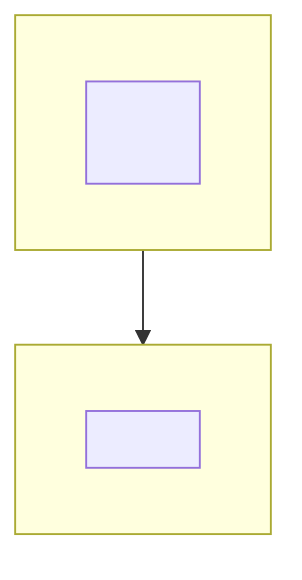
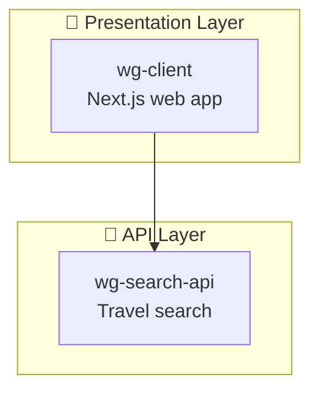

# Phase 6: Interactive Diagram Viewer

> **Goal**: Generate an interactive HTML viewer with Mermaid diagrams for all projects, derived from the analysis JSON files.

---

## Input

- `${ANALYSIS_DIR}/project-inventory.json` (from Phase 1)
- `${ANALYSIS_DIR}/service-topology.json` (from Phase 2)
- Each project's `copilot-instructions.md` (for architecture diagrams)

## Template

- `${SYSTEM_ARCH_ROOT}/WG3-Architecture-template.html`

## Output

- `${OUTPUT_ROOT}/WG3-Architecture-Interactive.html`

---

## Instructions

### Step 1: Read Service Topology

Load `service-topology.json` to get:
- List of all services with their `type`, `role`, and `callsServices`
- `dependencies` array for edges
- `layers` object for grouping

### Step 2: Generate System Overview Diagram

Create the main Mermaid diagram from topology data:

```mermaid
graph TB
    subgraph Presentation["📱 Presentation Layer"]
        %% For each service in layers.presentation
        <SERVICE_ID>["<service-name><br/><role>"]
    end
    
    subgraph Orchestration["🎯 Orchestration Layer"]
        %% For each service in layers.orchestration (if exists)
    end
    
    subgraph API["🔌 API Layer"]
        %% For each service in layers.api
    end
    
    subgraph Data["💾 Data Layer"]
        %% For each service in layers.data
    end
    
    subgraph Shared["🔧 Shared Library"]
        %% For each service in layers.shared
    end
    
    %% For each dependency edge, add:
    %% <from-id> --> <to-id>  (for http dependencies)
    %% <from-id> -.-> <to-id> (for library dependencies)
    
    %% Add click callbacks for drill-down:
    %% click <SERVICE_ID> call navigateTo("<service-id>")
```

**Diagram Generation Rules**:

| Field | Mermaid Mapping |
|-------|-----------------|
| `service.name` | Node ID (lowercase, no dashes) |
| `service.name + role` | Node label |
| `dependency.from → to` | Edge (solid for http, dashed for library) |
| Layer from `layers` object | Subgraph assignment |

### Step 3: Generate Per-Project Diagrams

For each project in `project-inventory.json`:

1. **Read copilot-instructions.md** from the project's `.ai-instructions/`
2. **Extract existing Mermaid diagram** if present (look for ```mermaid blocks)
3. **If no diagram exists**, generate one from:
   - `internalModules` from `service-topology.json`
   - Key patterns from copilot-instructions.md
   - Service dependencies

**Per-Project Diagram Format**:



### Step 4: Build Diagrams Array

Construct the JavaScript `diagrams` array for the HTML:

```javascript
const diagrams = [
    {
        id: 'system-overview',
        title: 'System Overview',
        code: `<generated-mermaid-from-step-2>`
    },
    // For each project:
    {
        id: '<project-name>',
        title: '<N>. <project-name> (<type>)',
        code: `<generated-mermaid-from-step-3>`
    }
    // ... one entry per project
];
```

### Step 5: Generate HTML Output

1. **Copy** `WG3-Architecture-template.html` to output location
2. **Replace** the placeholder `const diagrams = [...]` section with the generated diagrams array
3. **Update** the page title to match the system name

---

## Output Validation

| Check | Requirement |
|-------|-------------|
| All projects included | Count of per-project diagrams matches project-inventory ready count |
| System overview complete | All services from topology appear in overview diagram |
| Click navigation works | Every node has a `click ... call navigateTo()` callback |
| Drill-down exists | Each click target has a matching diagram id |
| HTML renders | File opens in browser without Mermaid syntax errors |

---

## Diagram Style Guide

### Node Naming Convention

| Service Type | ID Pattern | Label Format |
|--------------|------------|--------------|
| Frontend | `CLIENT` | `<name><br/><framework> Frontend` |
| Backend | `<SERVICE_CAPS>` | `<name><br/><short-role>` |
| Shared Library | `LTS` or `CORE` | `<name><br/>Core Integrations` |

### Edge Types

| Dependency Type | Mermaid Syntax | Visual |
|-----------------|----------------|--------|
| HTTP runtime | `A --> B` | Solid line |
| Library/compile-time | `A -.-> B` | Dashed line |
| Message queue | `A -->>` B | Arrow with double head |

### Layer Colors (CSS in template)

| Layer | Subgraph Emoji | Purpose |
|-------|----------------|---------|
| Presentation | 📱 | User-facing apps |
| Orchestration | 🎯 | Workflow coordinators |
| API | 🔌 | Business logic services |
| Data | 💾 | Data access services |
| Shared | 🔧 | Common libraries |

---

## Example: Generated System Overview

Given this `service-topology.json` snippet:

```json
{
  "services": [
    { "name": "wg-client", "type": "Frontend", "role": "Next.js web app" },
    { "name": "wg-search-api", "type": "Backend", "role": "Travel search" }
  ],
  "dependencies": [
    { "from": "wg-client", "to": "wg-search-api", "type": "http" }
  ],
  "layers": {
    "presentation": ["wg-client"],
    "api": ["wg-search-api"]
  }
}
```

**Generated Mermaid**:


